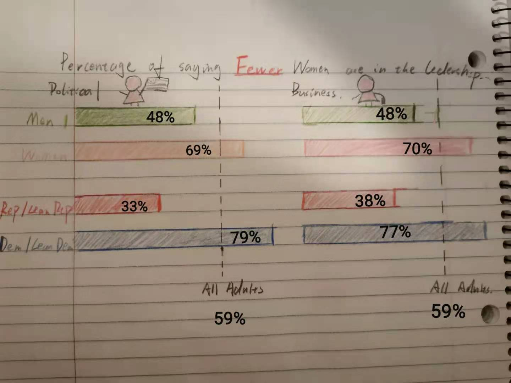
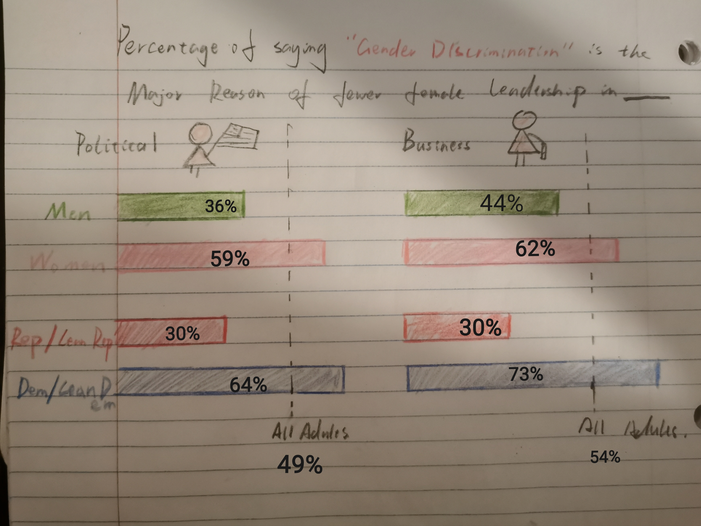

# Telling-stories-with-data
Telling Stories With Data, Xingyue Jiang's Portfolio Page 

# About Me
Hello! I am Xingyue Jiang, a second-year student from MSPPM program. Friends call me Ruby. I have worked in several non-profit organizations and hope to be a policy analyst after graduation.

# What I hope to learn...
I hope to learn to create a portfolio that can be used in job applications. It's my first time to learn Github and Tableau, too.

# Portfolio
Here is all of my cool data visualizaton will go!

# Assignment 2: Government Debt Rati
# Government Debt Bar Chart
<iframe src="https://data.oecd.org/chart/69GB" width="860" height="645" style="border: 0" mozallowfullscreen="true" webkitallowfullscreen="true" allowfullscreen="true"><a href="https://data.oecd.org/chart/69GB" target="_blank">OECD Chart: General government debt, Total, % of GDP, Annual, 2018</a></iframe>

# the Grid of Line Charts 
Government debt-to-GDP ratio data demonstrated by the grid of line charts on Flourish.

# Third Data Visualization-Scatterplot with an Average

My understanding of the dataset is to show the Debt-GDP ratio of different OECD countries over the years. Three visualizations have different focuses.

The first bar chart gives a comparison between countries in a fixed year. The first visualization is simple but straightforward. The country's ratio goes up from left to right. The audience can get a basic idea of which country has the highest/lowest ratio in 2018, and the ratio range by percentage. The second visualization shows the trendline of the debt-to-GDP ratio by countries. It's hard to compare different countries' ratio levels, but the audience gets a general idea of how each country's financial performance is from 1996 to 2019. The third visualization is a scatterplot. Using the scatter plot, I wish to compare different countries' ratio all together in a more precise way. The above-average line makes it easier to tell if the country's performance is satisfying. Also, I use the blue color series to represent years, which is convenient to track the ratio changes from 1996 to 2019.

# Assignment 3&4
# Data-Viz chosen from a report by Pew Center

This graph is from the Pew Center’s 2018 American Social Trend Dataset. It’s also a part of the report, “Women and Leadership 2018.” The report claims that although Americans say they would like to see more women in top leadership positions, men still have an easier path both in political offices and large business companies. Female/Male and Republicans/Democrats also have widely different attitude towards the female leadership. I chose the graph because it has a very clear message: to show the comparison between F/M and Rep/Dem. Also, it includes two sub groups at one time. The report argues that the F/M gaps persist within parties. How to revise the basic bar chart with two related comparisons will be the focus of my assignment.

  - source: https://www.pewsocialtrends.org/2018/09/20/women-and-leadership-2018/pst-09-20-18_gender-leadership-00-00/

  - dataset: https://www.pewsocialtrends.org/dataset/american-trends-panel-wave-36/ 

# Wireframe
 

# Feedback and Reflection
I selected two friends that major in liberal arts. I suppose if a reader without a statistics background can easily understand the visualization, the message will be better conveyed to the general public. Friend 1 is male and Friend 2 is female. 

Friend#1
  - “Icons are eye catchy but not very necessary. And I don’t quite get what they are at first.”
  - “It’s confusing that the rep and female use very similar colors.”
  - “I get it that ‘fewer women’ and ‘there is gender discrimination’ are two different things. But It seems a little bit redundant. Especially when the two phrases are highlighted.”

Friend #2
  - “Too many little graphs. Is it possible to combine them altogether?”
  - “Icons are weird. I don’t think business and political leaders’ difference is a focus of the visualization.”
  - “Can’t get the message at first sight. Need to look back and forth. ”
  - “The percentage figures need a better format.”

My reflection:
  - Get rid of icons: I didn’t expect that my audience don’t like the icons. I thought they are fun and clear, it’s my bad painting’s fault. But my friend is right, they are too eye catchy. Even people can tell that which is business/politics, it doesn’t help to understand the wide gap between different political parties and genders. The readers wasted time on a relatively unimportant category.
  - Small graphs may distract attention: I will try to experiment with other graph type rather than simple bar chart groups.
  - Colors and text: The rep/dem group remains red and blue. I go with the original color choice of Pew Center to use yellow and green, 
  - Keep the “fewer group”. I will keep the "fewer" attitude group. The raw data of "gender discrimination" doesn't suggest a wide gap (as discussed in critique), and readers get similar messages from "fewer group" and "gender discrimination". 

# Final Solution

 

Written Summary:
  - Firstly, I used the "visualizing health wizard". This data-viz should be a comparison to show wide gap in partisan ang gender groups. The figures can be general. I stated in my critique that there is no relationship between partisan and gender groups so we should separately look at them. I was wrong at that. Thanks to my friends who pointed out there were too many little graphs in my visualization, I reread the report and found out it mentioned there is a consistency of gender gap inside political parties. Therefore, the partisan and gender groups should be kept in the same graph to show the consistency.
  - Another point is that if "fewer women" and "gender discimination" convey the same message. The logic of the report is: First, Americans want to see more women in the top position. Second, the truth is there are "fewer women" in those top position. Finally, people conclude the reason for fewer women in leadership position as "gender discrimination". I decide to only keep the "fewer" in my visualizaiton not because I feel the third part's data is meaningless. It is because I looked back at the dataset and there is not "a wide view gap" in the third point. A similar percentage of people think the reason is "family" or "the working enviroment is not ready for female employees". I think there is a complexity in the third point. It may be better to make an individual graph of different reasons why there are fewer women in top leadership instead of being used to show wide gap.
  - The template I used is originally to show different political party's support rate. I think it will be a much more clear comparison to put female, male, republican and democrat closely together with straight forward figures. 
  - The comparison should include four different groups. If all adults' percentgae is also listed, it may cause some confusion and also harder to make a comparison between the overall percentage and each group's percentage. So I used a dotted line for all adults. 
  - Colors. There might be customized color series. We use red for Republicans and blue for Democrats. We tend to use red or pink for women and blue for men. But in this case, female/male is better to use a different color series from partisan groups. So I adopt light/dark color series, which is yellow and green.
  - It is really important to listen to friend's feedback! I changed some thoughts that I stated in my critique. For example, the use of icons. I stated that the icons came to my attention first and I thought it's fun. But I ignored that the business/political fileds aren't a focus of my comparison. Sometimes we may naturally think people will feel the same way as we do, especially when it comes to cartoons, icons and some particular colors. Don't forget to collect readers' feedback. Visualization may sometimes about subjective feelings, but whether the visualizaiton gives a clear message or not could be achieved by testing and revising.
  
  
  

