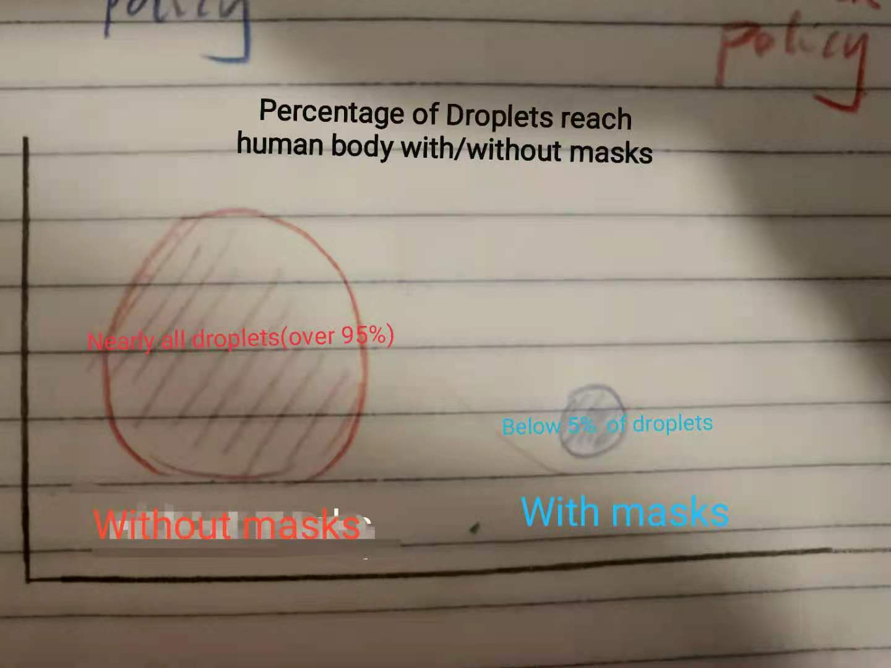

# Final Project
# Part 1
# Summary
- The project will discuss the mask wearing in the year of 2020 under the covid pandemic. 
- Story Arc: 

① Mask helps! 

The presentation will start with the facial mask's benefits, especially for preventing the spread of COVID-19. A: Scientifc figures on how facial mask work. B: Predictions that deaths prevented by wearing masks in U.S. C: Comparison of case number and death rate between area where people tend to wear facial mask/ not wear facial mask. 
             
 ② Who are using masks? 
 
 U.S is not performing well compared to other countries in persuading people wearing facial masks. We need to further discuss which group of people refuse to wear masks and the reasons. A: Gender/Partisan/Ethnic gap in wearing masks. B: Mask usage by U.S. county/around the world. C.U.S. citizens' attitude towards facial masks. 

③ We still need more people wear masks to overcome the pandemic (call to action).

A: The mask usage change since the covid. B. Policies changes regarding encouraging people to wear masks and provide free masks. Mask usage is increasing since the outbreak of pandemic, but people should continue: 1. Tell friends and families to wear masks. Do people know how tow wear masks properly? 2. More free masks for the needed people. Also, this part could include how to pick a right facial mask. A comparison of different materials for masks can be added at the end if time is permitted. 
             
# Sketch
# Line charts-death rates

# Scientific findings: Droplets blocked by the mask

# Mask usage by different education levels. Top reasons for not wearing masks.

# Mask usage increase by areas 

# Data
New York Times. "Mask Usage By County/Around World". https://github.com/nytimes/covid-19-data/tree/master/mask-use. 

Data World. @akash.kaul."COVID-19 Patient Survey May 2020". https://data.world/informatics-edu/covid-19-patient-survey-may-2020/insights.

IHME. "New IHME COVID-19 Model Projects Nearly 180,000 US Deaths". http://www.healthdata.org/news-release/new-ihme-covid-19-model-projects-nearly-180000-us-deaths.

USCF. Nina Bai. "Still Confused About Masks? Here’s the Science Behind How Face Masks Prevent Coronavirus". https://www.ucsf.edu/news/2020/06/417906/still-confused-about-masks-heres-science-behind-how-face-masks-prevent.

Amy Mueller and Loretta Fernandez. "Assessment of Fabric Masks as Alternatives to Standard Surgical Masks in Terms of Particle Filtration Efficiency". https://files.fast.ai/papers/masks_lit_review.pdf. 

Nature. Lynne Peeples. "Face masks: what the data say". https://www.nature.com/articles/d41586-020-02801-8.

CDC."Monitoring and Evaluation Action Guide: Wearing Masks as a COVID-19 Community Mitigation Strategy". https://www.cdc.gov/coronavirus/2019-ncov/php/mask-evaluation.html.

Pew Center. "Most Americans say they regularly wore a mask in stores in the past month; fewer see others doing it." Most Americans say they regularly wore a mask in stores in the past month; fewer see others doing it. https://www.pewresearch.org/fact-tank/2020/08/27/more-americans-say-they-are-regularly-wearing-masks-in-stores-and-other-businesses/.

GALLUP. Facial mask demographics. https://news.gallup.com/poll/315590/americans-face-mask-usage-varies-greatly-demographics.aspx.

Goldman Sachs. Mask and GDP. https://www.goldmansachs.com/insights/pages/face-masks-and-gdp.html. 

- How to use the data: Most data are in the format of csv. Some data need to be input manually.

Benefits of Masks: Prediction of death rate if masks are weared by 95% of people. Comparison of death rate by countries combined with comparison of mask usage by countries. Experiment figures of facial masks and high speed droplets.

Mask Usage and Attitudes: People with higher education level/ higher income tend to wear mask. Narrow down the groups of people who refuse to wear masks. The top reasons of people don't believe in masks. 

Call to action, Masks on: Sentiment analysis of policy regarding masks. Free masks provision by percentage. Assessment of different fabrics for a standard mask. 

# Method
- Step 1: Reorganizing the datasets. The raw dataset will be in csv. and docx. The final format will include parts of the data in a 
- Step 2: Wireframe. Complete the wireframe with the assitance of Balsamiq. Follow the step of assignment 3&4 to ask for friends' advice and revise. Some data-viz will be revised from existing data-viz. The number of data-viz revised from existing reports will not exceed two. 
- Step 3: Final Data-viz. The data visualization will be created by Tableau and Flourish. 
- Step 4: The final presentation will be created by shorthand, combining graphs and analysis. 

# Part 2
# Wireframe and Storyboard
link to shorthand page: 

# User Research 
research protocol

